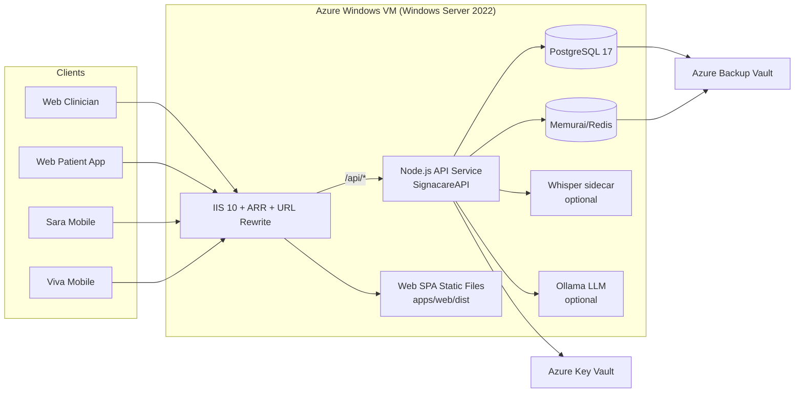

# Signacare EMR — Azure Windows VM Architecture & Deployment Reference

> **Legacy / reference only:** This Windows VM architecture is retained for
> traceability and Windows-only exception cases. It is not the active production
> deployment lane. Current Azure Linux deployment work should use
> `deploy/azure/main.bicep` and the Linux App Service runbook. See
> [`docs/operations/deployment-learnings.md`](../operations/deployment-learnings.md).

**Last updated:** 2026-05-20  
**Scope:** Single-VM Windows Server 2022 deployment (dev/test today, hardenable to production)  
**Primary runbook:** [azure-windows-server-deployment.md](./azure-windows-server-deployment.md)

## 1) High-Level Architecture



## 2) Detailed Runtime Architecture

### 2.1 Compute + Network
- One VM created via [deploy/azure/main-windows.bicep](/Users/drprakashkamath/Projects/Signacare/deploy/azure/main-windows.bicep).
- NSG allows inbound:
  - `443` from `httpsAllowedSource`
  - `80` from `httpsAllowedSource` (redirect to HTTPS)
  - `3389` from `rdpAllowedSource` only
  - `5986` from `winrmAllowedSource` only (default `None`)
- NSG denies all other inbound.

### 2.2 Host Processes
- `W3SVC` (IIS): TLS termination + reverse proxy + static SPA hosting.
- `SignacareAPI` Windows Service (node-windows): Node.js API process on `localhost:4000`.
- `postgresql-x64-17`: relational store.
- `Memurai`: Redis-compatible cache/queue backend.
- Optional:
  - Whisper Python sidecar
  - Ollama local model server

### 2.3 Reverse Proxy Contract
- IIS serves `apps/web/dist`.
- IIS rewrites `/api/*`, `/health`, `/ready`, `/metrics` to `http://localhost:4000/*`.
- SPA fallback rewrites non-file routes to `/index.html`.
- Config file: [deploy/azure/windows-vm/web.config](/Users/drprakashkamath/Projects/Signacare/deploy/azure/windows-vm/web.config).

## 3) Configuration Model

### 3.1 Environment Contract (canonical)
- API canonical env contract: [apps/api/.env.example](/Users/drprakashkamath/Projects/Signacare/apps/api/.env.example).
- Windows VM env template: [deploy/azure/windows-vm/env.windows-template](/Users/drprakashkamath/Projects/Signacare/deploy/azure/windows-vm/env.windows-template).

Required DB keys for runtime:
- `DB_HOST`
- `DB_PORT`
- `DB_NAME`
- `DB_USER`
- `DB_PASSWORD`
- `DB_APP_USER`
- `DB_APP_PASSWORD`

### 3.2 Secrets Backend Modes
- `SECRETS_BACKEND=env`: read from `.env`.
- `SECRETS_BACKEND=azure_keyvault`: resolve from Key Vault at startup (requires `AZURE_KEYVAULT_URL` + managed identity RBAC).
- Resolver implementation: [apps/api/src/config/secrets.ts](/Users/drprakashkamath/Projects/Signacare/apps/api/src/config/secrets.ts).

## 4) Deployment Artifact Contract

Deployment package is built with:
- [deploy/azure/windows-vm/00-package-release.sh](/Users/drprakashkamath/Projects/Signacare/deploy/azure/windows-vm/00-package-release.sh)

Expected extracted layout on VM:
- `D:\Signacare\app\package.json`
- `D:\Signacare\app\package-lock.json`
- `D:\Signacare\app\apps\api\dist\...`
- `D:\Signacare\app\apps\api\migrations\...`
- `D:\Signacare\app\apps\api\scripts\...`
- `D:\Signacare\app\apps\api\.env`
- `D:\Signacare\app\apps\web\dist\...`
- `D:\Signacare\app\packages\shared\dist\...`

## 5) Startup & Provisioning Scripts

Execution order on VM:
1. [01-setup-prerequisites.ps1](/Users/drprakashkamath/Projects/Signacare/deploy/azure/windows-vm/01-setup-prerequisites.ps1)
2. [02-create-database.ps1](/Users/drprakashkamath/Projects/Signacare/deploy/azure/windows-vm/02-create-database.ps1)
3. [03-deploy-app.ps1](/Users/drprakashkamath/Projects/Signacare/deploy/azure/windows-vm/03-deploy-app.ps1)
4. [04-configure-iis.ps1](/Users/drprakashkamath/Projects/Signacare/deploy/azure/windows-vm/04-configure-iis.ps1)
5. [05-install-services.ps1](/Users/drprakashkamath/Projects/Signacare/deploy/azure/windows-vm/05-install-services.ps1)
6. [06-configure-redis.ps1](/Users/drprakashkamath/Projects/Signacare/deploy/azure/windows-vm/06-configure-redis.ps1) (recommended for staging/prod)

## 6) Build/Runtime Dependency Matrix

Operator workstation dependencies:
- `git`
- `node` + `npm`
- `zip`
- `az` CLI (for infra provisioning/upload)

VM runtime dependencies:
- Windows Server 2022
- Node.js 20 LTS
- PostgreSQL 17
- Memurai (Redis-compatible)
- IIS 10 + URL Rewrite + ARR
- Optional: Python runtime + Whisper model assets, Ollama runtime + model assets

## 7) Azure-Specific Files & Runbooks

Infrastructure definitions:
- [deploy/azure/main-windows.bicep](/Users/drprakashkamath/Projects/Signacare/deploy/azure/main-windows.bicep)
- [deploy/azure/parameters.windows-dev.json](/Users/drprakashkamath/Projects/Signacare/deploy/azure/parameters.windows-dev.json)

Windows deployment runbook:
- [docs/guides/azure-windows-server-deployment.md](/Users/drprakashkamath/Projects/Signacare/docs/guides/azure-windows-server-deployment.md)

Related Azure/Lifecycle docs:
- [docs/plans/azure-staging-deployment.md](/Users/drprakashkamath/Projects/Signacare/docs/plans/azure-staging-deployment.md)
- [deploy/azure/README.md](/Users/drprakashkamath/Projects/Signacare/deploy/azure/README.md)

## 8) Production Hardening Checklist

- Replace self-signed IIS certificate with CA-issued certificate.
- Move all secrets from `.env` to Key Vault and switch `SECRETS_BACKEND=azure_keyvault`.
- Enable VM backups and test restore.
- Enforce firewall and NSG source restrictions to named corporate CIDRs.
- Set up monitoring/alerting for API health, service crashes, disk pressure, DB and Redis availability.
- Run post-deploy smoke checks (`/health`, `/ready`, UI load) on every release.

## 9) Quick Validation Commands

From VM:
```powershell
Get-Service SignacareAPI,postgresql-x64-17,Memurai,W3SVC
curl http://localhost:4000/health
curl http://localhost:4000/ready
```

From operator workstation:
```bash
curl -k https://<vm-fqdn>/health
curl -k https://<vm-fqdn>/ready
```
